# Fixing Large Language Models' Specification Misunderstanding for Better Code Generation (μFiX)
--- ---
- [Overview](#overview)
  - [Folder Structure](#folder-structure)
- [Environment Configuration](#environment-configuration)
- [Datasets](#datasets)
- [Run Experiments](#run-experiments)
  - [Code Generation](#1-code-generation)
  - [Code Sanitizer](#2-code-sanitizer)
  - [Code Evaluation](#2-code-evaluation)
- [Illustrative Examples](#illustrative-examples)
- [Experimental Results](#experimental-results)
- [Acknowledgement](#acknowledgement)

## Overview
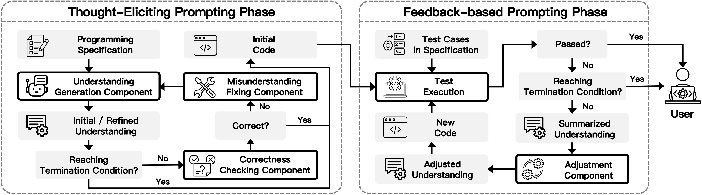

--- --- ---

### Folder Structure
```
.
├── CodeBLEU
│   ├── __init__.py
│   ├── bleu.py
│   ├── calc_code_bleu.py
│   ├── dataflow_match.py
│   ├── keywords
│   ├── parser
│   ├── syntax_match.py
│   ├── utils.py
│   └── weighted_ngram_match.py
├── dataset
│   ├── apps
│   ├── humaneval
│   ├── humaneval_ET
│   ├── humanevalplus
│   ├── mbpp
│   └── mbpp-ET
├── evalplus-0.1.0
├── evaluation
│   ├── chatgpt
│   ├── deepseek-coder
│   ├── generate.py
│   ├── get_codeblue.py
│   ├── humaneval
│   ├── model.py
│   ├── sanitize.py
│   └── test.py
├── experiment
├── figs
├── .gitignore
├── README.md
└── requirements.txt
```

## Environment Configuration
--- ---
Make sure to use python 3.8 or later:
```
conda create -n llm python=3.8;
conda activate llm;
```
Detail configuration can be found in ```muFiX/requirements.txt```.

## Datasets
####  Statistics of our used datasets.
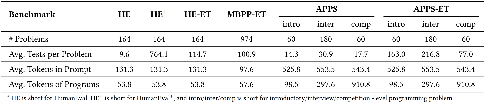

--- --- ---

Note that our used data are all public datasets, and they can also be found in the following related work:
- [HumanEval](https://github.com/openai/human-eval)
- [HumanEval+](https://github.com/evalplus/evalplus)
- [APPS](https://github.com/hendrycks/apps)
- [HumanEval-ET, APPS-ET, and MBPP-ET](https://github.com/YihongDong/CodeGenEvaluation)

## Run Experiments
--- ---
### 1) Code Generation
We use DeepSeek-Coder as the representative LLM on HumanEval dataset. 
The ```evaluation/deepseek-coder/HumanEval-mufix``` folder contains original prompt for HumanEval datasets.

```
# μFiX
cd muFiX/evaluation/;
python generate.py --model=deepseek-coder --prompt=mufix --dataset=humaneval --temperature=0.7;
```
The generated programs are saved in the ```muFiX/evaluation/deepseek-coder/HumanEval-mufix/``` folder directory.
Hence, we can set corresponding parameters (i.e., --model, --prompt, --dataset, and --temperature) to run the experiments.

### 2) Code Sanitizer
LLM-generated code may include natural-language lines or special code blocks (e.g., \`\`\`python\`\`\`), leading to non-compilable code. 
Following [prior work](https://github.com/evalplus/evalplus?tab=readme-ov-file#code-post-processing), we employ a simple post-processing tool to clean all LLM-generated code. 

```
# μFiX
cd muFiX/evaluation/;
python sanitize.py --folder=./deepseek-coder/HumanEval-mufix;
```

### 3) Code Evaluation
To evaluate the above generated code, run
```
# Pass@k and AvgPassRatio
cd muFiX/evaluation/;
python test.py --model=deepseek-coder-mufix --dataset=humaneval --temperature=0.7;
```


## Illustrative Examples
--- ---
#### 1) An example of μFiX in understanding generation.
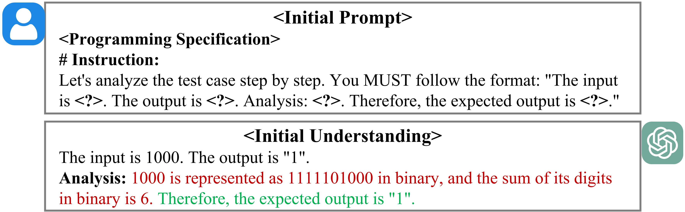

--- ---

#### 2) An example of μFiX in correctness checking of the understanding.
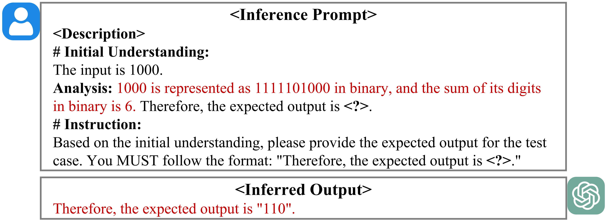

--- ---

#### 3) An example of μFiX in fixing the misunderstanding.
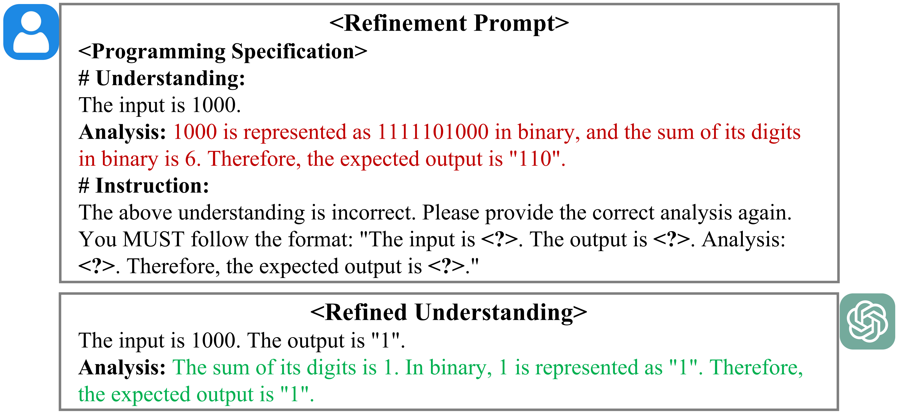

--- ---

#### 4) An example of μFiX in adjusting the understanding.
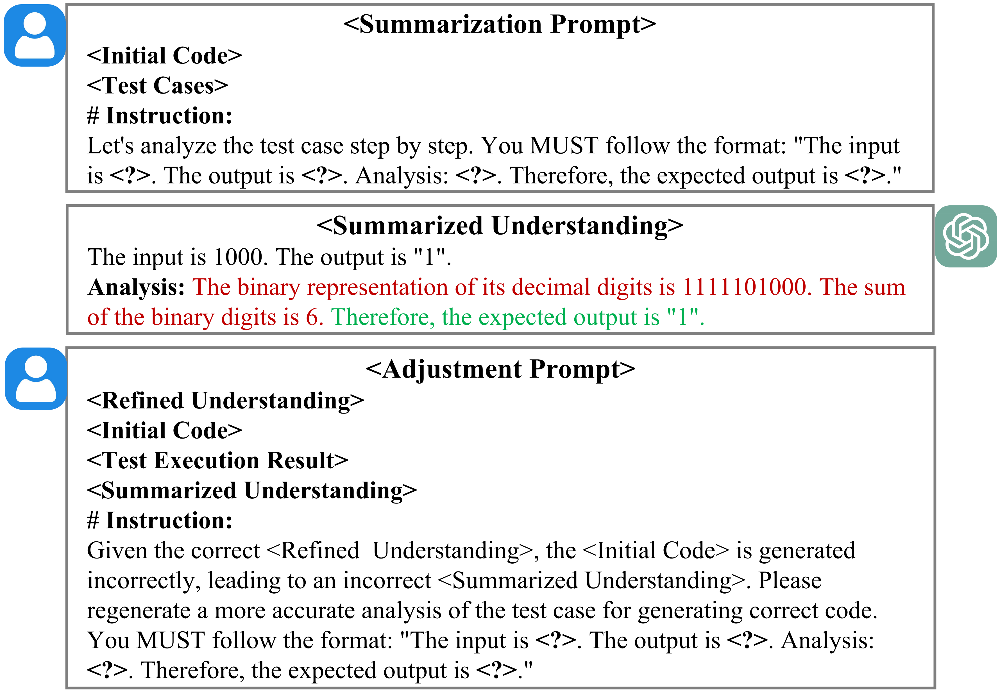

--- ---

## Experimental Results
--- ---
#### 1) Effectiveness comparison on ChatGPT in terms of Pass@1 (↑) and AvgPassRatio (↑).
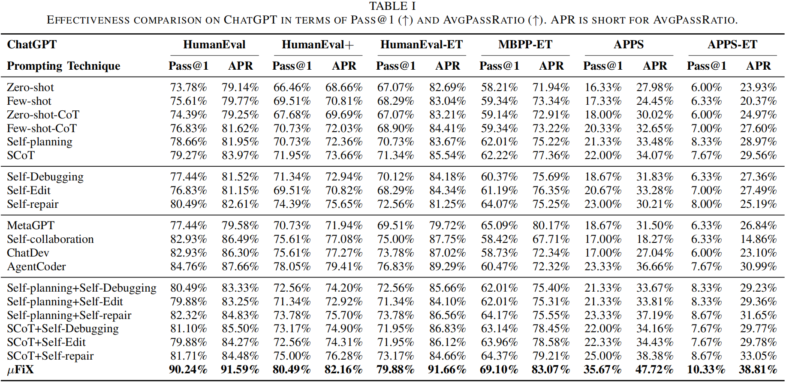

--- ---

#### 2) Effectiveness comparison on DeepSeek-Coder in terms of Pass@1 (↑) and AvgPassRatio (↑).
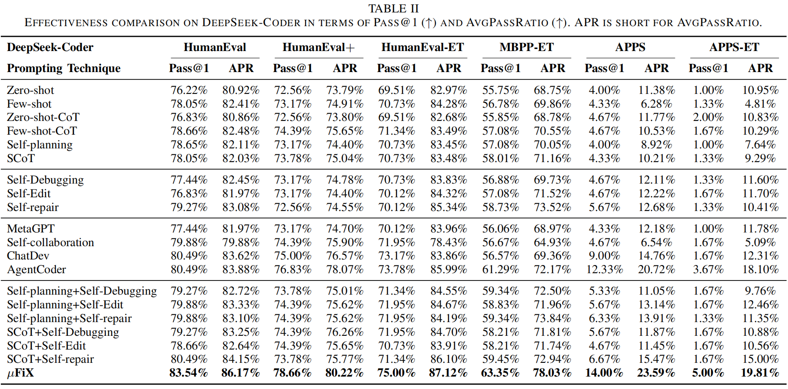

--- ---

#### 3) Comparison between μFiX and its variants in terms of Pass@1 (↑) and AvgPassRatio (↑).
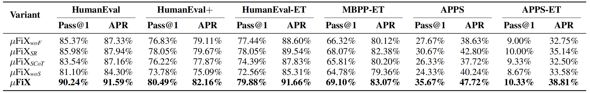

--- ---

#### 4) Influence of Hyper-parameters N and M in terms of Pass@1 (↑) and AvgPassRatio (↑).
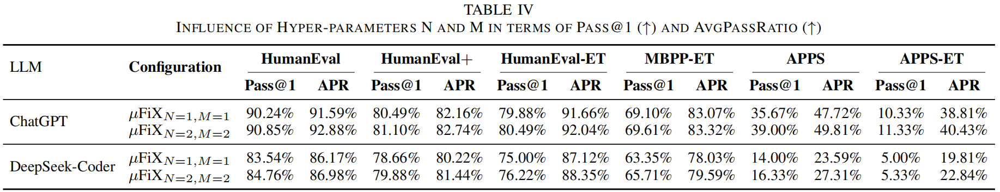

--- ---

#### 5) Comparison between μFiX_{woF} and SCoT+CodeT in terms of Pass@1 (↑) and AvgPassRatio (↑).
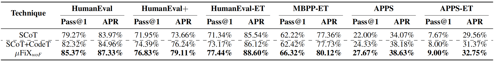

--- ---

#### 6) Influence of the number of test cases used in μFiX.
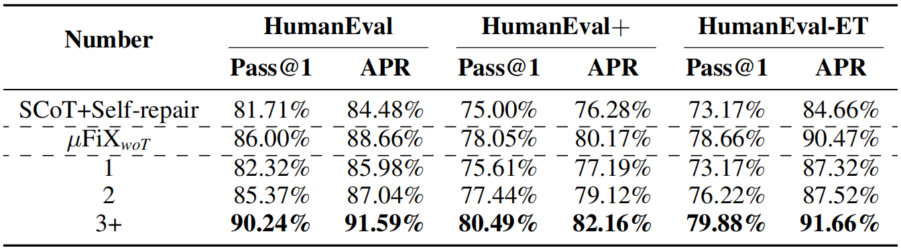

--- ---

#### 7) Influence of the decoding temperature.
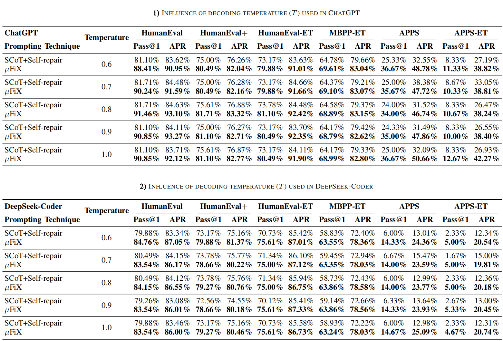

--- ---

#### 8) Effectiveness comparison on ChatGPT in terms of Pass@1 (↑), Pass@2 (↑), and Pass@3 (↑).
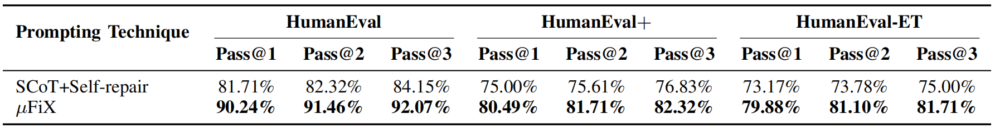

--- ---

#### 9) Effectiveness comparison on ChatGPT in terms of CodeBLEU (↑).
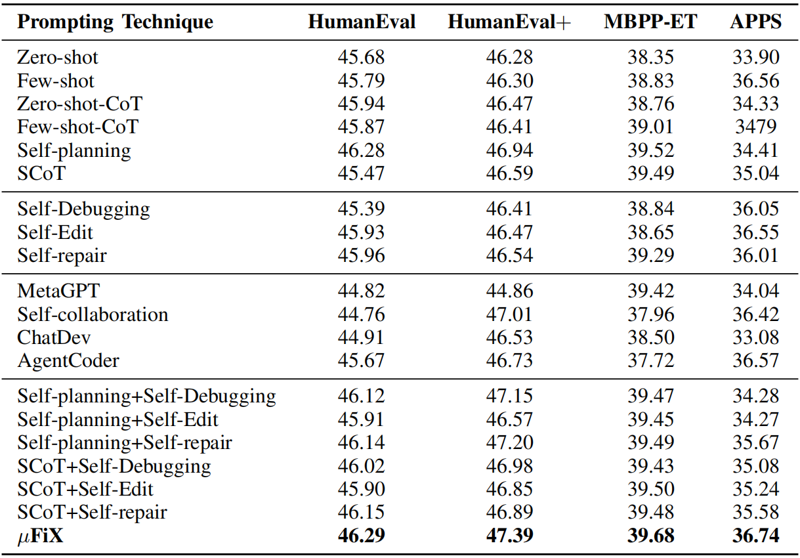

--- ---


## Acknowledgement
--- ---
We are very grateful that the authors of HumanEval, APPS, MPBB, HumanEval+, CodeScore, CodeBLEU, and DeepSeek-Coder make their code/data publicly available so that we can build this repository on top of them.

